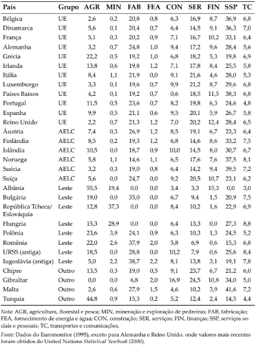

# Tarefa 2 - Análise Componentes Principais

Karl Pearson (1901), inicialmente descreveu a técnica de análise de componentes principais.
Ele acreditou que era a solução correta para alguns problemas de interesse biométricos naquele tempo.
Hotelling (1933), posteriormente descreveu métodos computacionais práticos, mesmo naquele momento, os cáculos eram complexos para poucas variáveis porque tinham que ser feitos à mão.

A análise de componentes principais é um dos métodos multivariados mais simples, com objetivo de encontrar p variáveis $X_1, X_2,...,X_p$ e encontrar combinações destas para produzir índices $Z_1, Z_2,...,Z_p$ que sejam não correlacionados na ordem de sua importância, e que descrevam a variação nos dados.
Os índices $Z$ são, os componentes principais.

# Exemplo 6.1 - Pardocas

Após uma forte tempestade em 1º de fevereiro de 1898, diversos pardais moribundos foram levados ao laboratório biológico de Hermon Bumpus na Universidade de Brown em Rhode Island.
Subsequentemente, cerca de metade dos pássaros morreu, e Bumpus viu isso como uma oportunidade de encontrar suporte para a teoria da seleção natural de Charles Darwin.
Para esse fim, ele fez oito medidas morfológicas em cada pássaro, e também os pesou.
Os resultados de cinco das medidas são mostrados na Tabela 1.1, para fêmeas somente.

```{r, include=FALSE}

library(tidyverse)

```

```{r}
pardocas <- read.csv("Bumpus_sparrows.csv")

va_pardocas <- pardocas[,-1]
head(va_pardocas, 5)
```

```{r}
# Covariâncias da variáveis

# Zi é a combinação linear das variáveis originais multiplicadas por escalares.
# 
# A variância de Zi, é o lambda i que é um autovalor - os autovalores são as variância dos componentes principais.
# Os escalares (constantes aij) são os componentes dos autovetor escalonado. No qual a soma dessas constantes ao quadrado seja 1.
# 
va_pard_mtx_cov <- cov(va_pardocas)
va_pard_mtx_cov[upper.tri(va_pard_mtx_cov, diag = F)] <- NA

print("Matrix de covariância das variáveis")
print(round(va_pard_mtx_cov,4))


var_va_pard <- diag(va_pard_mtx_cov)


print(cat("\n","Variâncias das Variáveis originais"))
var_va_pard
traco_var_va_pard <- sum(var_va_pard)
print(cat("\n","Traço: ",round(traco_var_va_pard,4), "\n"))


# Correlação das variáveis

va_pard_mtx_cor <- cor(va_pardocas)

va_pard_mtx_cor[upper.tri(va_pard_mtx_cor, diag = F)] <- NA

print(cat("\n","Matrix de correlação das variáveis"))
print(round(va_pard_mtx_cor,4))

sum_diag_corr_pard <- sum(diag(va_pard_mtx_cor))


print(cat("\n","Traço: ",round(sum_diag_corr_pard,4), "\n"))


```

## Padronização

```{r}
pca1 <- prcomp(va_pardocas, scale. = T) 

summary(pca1)
```

## Autovalores e Autovetores

```{r}
autovalores1<- pca1$sdev^2

autovetores1 <- pca1$rotation


escore <- pca1$x


print(cat("\n","Autovalores: \n ",round(autovalores1,4), "\n"))
```


```{r echo=FALSE}
# Autovetores

print(cat("\n","Autovetores: \n "))
autovetores1
```


```{r}
graf_escor <- cbind(data.frame(pardocas$Survivorship),escore)

plot(graf_escor$PC1, graf_escor$PC2,
     pch = ifelse(pardocas$Survivorship == "S", 1, 16),
     xlab = "PC1", ylab = "PC2")
abline(h=0)
abline(v=0)
legend("bottomleft", legend=c("Sobrevive","Não sobrevive"), pch=c(1,16))
```

# Exemplo 6.2

Considere os dados na Tabela 1.5.
Eles mostram as porcentagens da força de trabalho em nove diferentes tipos de indústrias para 30 países europeus.
Neste caso, méto-dos multivariados podem ser úteis para isolar grupos de países com padrões similares de empregos, e, em geral, ajudar a compreender os relacionamentos entre os países.
Diferenças entre países que são relacionados a grupos políti-cos (UE, a União Europeia; AELC, a área europeia de livre comércio; países do leste europeu e outros países) podem ser de particular interesse.

### Tabela 1.5 Porcentagens da força de trabalho de empregados em nove diferentes grupos de indústrias em 30 países na Europa

{fig-align="center" width="50%"}

```{r}
emprego <- read.csv("Euroemp.csv")

head(emprego)

va_emprego <- emprego[,-(1:2)]


```

```{r}
boxplot(va_emprego, main = "Boxplot das variáveis", xlab = "Tipo de industria", ylab = " Porcentagens da força de trabalho de empregados")
```

```{r}
va_emp_mtx_cov <- cov(va_emprego)
va_emp_mtx_cov[upper.tri(va_emp_mtx_cov, diag = F)] <- NA

print("Matrix de covariância das variáveis")
print(round(va_emp_mtx_cov,4))


var_va_emp <- diag(va_emp_mtx_cov)


print(cat("\n","Variâncias das Variáveis originais"))
var_va_emp
traco_var_va_emp <- sum(var_va_emp)
print(cat("\n","Traço: ",round(traco_var_va_emp,4), "\n"))


# Correlação das variáveis

va_emp_mtx_cor <- cor(va_emprego)

va_emp_mtx_cor[upper.tri(va_emp_mtx_cor, diag = F)] <- NA

print(cat("\n","Matrix de correlação das variáveis"))
print(round(va_emp_mtx_cor,4))

sum_diag_corr_emp<- sum(diag(va_emp_mtx_cor))


print(cat("\n","Traço: ",round(sum_diag_corr_emp,4), "\n"))


```

## PCA - Autovalores & Autovetores

```{r}
pca2 <- prcomp(va_emprego, scale. = T)

summary(pca2)

```

```{r}
# Autovalores

autovalores2 <- pca2$sdev^2

print(cat("\n","Autovalores: \n ",round(autovalores2, 4), "\n"))

# Autovetores

print(cat("\n","Autovetores: \n "))
pca2$rotation


escore <- pca2$x

graf_escor2 <- data.frame(escore)

```

```{r}
plot(graf_escor2$PC1, graf_escor2$PC2, type="n", 
     xlab="PC1", ylab="PC2", main="")
text(graf_escor2$PC1, graf_escor2$PC2,labels=emprego$Country, cex=0.5)
abline(h=0)
abline(v=0)
```

